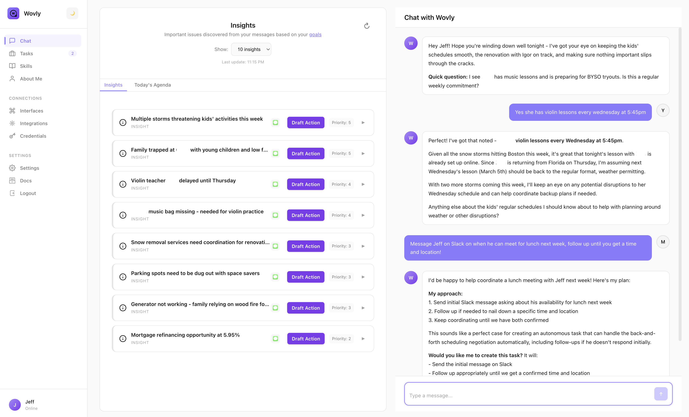

# Wovly

**Your Autonomous Personal AI Communication Assistant**

[](https://opensource.org/licenses/MIT)
[](https://github.com/bluerune234/wovly)
[](https://www.electronjs.org/)

A privacy-first desktop AI communication assistant that manages your contacts, follow ups, chat analysis, and remembers context across Email, Slack, iMessage, WhatsApp, Telegram, and more.

<p align="center">
  
</p>

---

## Features

### 🧠 Intelligent Memory System
- **Long-term Memory** – Remembers facts, relationships, and preferences across conversations
- **Daily Logs** – Automatic conversation summarization and context retention
- **Personal Profile** – Remembers who you are and your core facts, like spouse, family, job, location, allergies, hobbies, airline seat preference

### 💬 Multi-Platform Communication and Research
- **Unified Inbox** – Manage Email, Slack, iMessage, WhatsApp, Telegram, and Discord from one interface
- **Voice Mimic** – Learns your communication style per contact and platform
- **Cross-Platform Coordination** – "Text my wife, then Slack my boss" in a single command
- **Conversation Research** - "Extract any issues from the Sales slack channel and email the summary to the CEO"

### 🤖 Autonomous Customizable Task Execution
- **Fire and Forget** – Delegate outcomes, not drafts: "Schedule a meeting with John next week"
- **Persistent Follow-ups** – Monitors for replies and continues workflows automatically
- **Background Processing** – Tasks run in the background until completion

### 🤖 Customizable Skills
- **Teach Once, Automate Forever** – Define standard operating procedures once, and Wovly follows them consistently: "When a customer reports a bug, always log it in Jira and notify the eng team on Slack"
- **Personal Playbooks** – Create reusable workflows tailored to your role: "Weekly status report: summarize my sent emails, check Asana tasks, draft update to manager"
- **Constraint-Aware Execution** – Set guardrails for sensitive actions: "Never auto-send messages to executives without approval"

### 🌐 Browser Automation
- **Web Research** – Navigate websites, extract data, fill forms
- **Credential Management** – Securely stored login credentials for automated authentication
- **Anti-Detection** – Built-in measures to reduce bot detection

### 🔒 Privacy-First Architecture
- **100% Local** – All data stored on your machine, no cloud sync
- **Multi-User Support** – Per-user data isolation for shared computers
- **Encrypted Credentials** – OS-level encryption via Keychain/DPAPI/libsecret

---

## Integrations

| Integration | Capabilities |
|-------------|-------------|
| **Google Workspace** | Gmail read/write, Calendar management, event creation |
| **Slack** | Send messages, read channels, search DMs, user lookup |
| **iMessage** | Send/read texts, contact resolution (macOS only) |
| **WhatsApp** | Two-way messaging, remote control interface |
| **Telegram** | Bot interface, remote commands, notifications |
| **Discord** | Server messaging, channel management |
| **Asana** | Task management, project tracking |
| **Notion** | Page access, database queries |
| **GitHub** | Repository access, issue tracking |
| **Reddit** | Browse posts, read comments |
| **Spotify** | Playback control, music search |
| **Browser Automation** | Web navigation, form filling, data extraction |

---

## LLM Providers

Choose your preferred AI model:

| Provider | Models |
|----------|--------|
| **Anthropic** | Claude Sonnet 4, Claude Haiku, Claude Opus |
| **OpenAI** | GPT-4o, GPT-4 Turbo, GPT-4o Mini |
| **Google** | Gemini 1.5 Pro, Gemini 1.5 Flash |

---

## Use Cases

### Scheduling & Coordination
```
"Schedule a meeting with John next week"
→ Emails John, negotiates times, checks your calendar, creates the event

"Text my wife to coordinate kid pickup today"
→ Converses to align schedules and confirms the plan

"Chris sent me a calendar link in Slack. Find a time and book it"
→ Opens the link, cross-references your calendar, completes booking
```

### Communication & Research
```
"Based on the PRD and recent Slack messages, write an update to the sales team"
→ Synthesizes context and drafts a personalized message

"Email the top 3 candidates and ask about availability"
→ Sends personalized outreach and tracks responses

"Find Jeff's favorite Marvel movie - follow up until you get an answer"
→ Persists through vague responses until getting a definitive answer
```

### Web Automation
```
"Go to LinkedIn and get the profile summary of [person]"
→ Navigates and extracts the information

"Check flight prices from Boston to Miami on Google Flights"
→ Browses the site and reports options

"Fill out the contact form on [website] with my information"
→ Navigates, fills fields, and submits
```

### Monitoring & Alerts
```
"Monitor the weather and alert me if it's going to rain"
→ Checks periodically and notifies before rain

"Watch my inbox for emails from [client] and summarize immediately"
→ Monitors and alerts in real-time
```

---

## Installation

### Prerequisites

- **Node.js** 18+
- **macOS** (full feature support) or Windows/Linux (without iMessage)
- API key for at least one LLM provider

### Quick Start

```bash
# Clone the repository
git clone https://github.com/bluerune234/wovly.git
cd wovly

# Install dependencies
npm install

# Start the application
npm run dev
```

### Configuration

#### 1. LLM API Keys

Go to **Settings** → **AI Providers** and add your API keys:

| Provider | Get API Key |
|----------|-------------|
| Anthropic | https://console.anthropic.com/ |
| OpenAI | https://platform.openai.com/api-keys |
| Google | https://aistudio.google.com/app/apikey |

#### 2. Google Workspace

1. Go to [Google Cloud Console](https://console.cloud.google.com/)
2. Create a new project
3. Enable **Gmail API** and **Google Calendar API**
4. Create OAuth 2.0 credentials (Desktop app)
5. In Wovly: **Integrations** → **Google Workspace** → Enter Client ID & Secret

#### 3. Slack

1. Go to [Slack API Apps](https://api.slack.com/apps)
2. Create a new app "From scratch"
3. Add **User Token Scopes**:
   - `channels:history`, `channels:read`, `chat:write`
   - `groups:history`, `groups:read`, `im:history`, `im:read`, `im:write`
   - `users:read`
4. In Wovly: **Integrations** → **Slack** → Follow setup wizard

#### 4. iMessage (macOS only)

- Works automatically on macOS
- Grant Contacts access when prompted
- Full Disk Access may be required for message history

#### 5. Other Integrations

Configure WhatsApp, Telegram, Discord, and other integrations from the **Integrations** page in the app.

---

## Architecture

```
wovly/
├── apps/
│   ├── desktop/              # Electron main process
│   │   ├── main.js           # Core logic, IPC handlers, integrations
│   │   └── preload.js        # IPC bridge to renderer
│   └── ui/                   # React frontend
│       └── src/
│           ├── App.tsx       # Main UI components
│           └── styles.css
├── packages/                 # Shared modules
│   ├── agent-core/
│   ├── memory/
│   ├── integrations/
│   ├── llm/
│   ├── scheduler/
│   └── tools/
├── docs/                     # Documentation (Mintlify)
└── ~/.wovly-assistant/       # User data (outside repo)
    ├── users.json            # User registry
    └── users/
        └── {username}/       # Per-user isolated data
            ├── settings.json # API keys, tokens
            ├── credentials.enc # Encrypted credentials
            ├── memory/       # Daily logs, long-term memory
            ├── tasks/        # Active and completed tasks
            ├── skills/       # Custom skill definitions
            ├── profiles/     # User profile data
            └── browser-data/ # Per-user browser sessions
```

---

## Privacy & Security

- **All data stays local** – No cloud sync, no telemetry, no tracking
- **Per-user isolation** – Each user's data is completely separated
- **Encrypted credentials** – OS-level encryption (Keychain/DPAPI/libsecret)
- **Direct API calls** – Requests go directly to providers, no proxy
- **Local browser automation** – Chromium runs on your machine
- **No data leaves your machine** except for API requests to providers you configure and prompts sent to LLM services (Anthropic, OpenAI, Gemini)

---

## Documentation

Full documentation available at: **[docs.wovly.dev](https://docs.wovly.dev)** (coming soon)

Or browse the `/docs` directory for:
- [Installation Guide](docs/installation.mdx)
- [Features](docs/features/)
- [Integrations](docs/integrations/)
- [Architecture Reference](docs/reference/architecture.mdx)
- [Security](docs/reference/security.mdx)
- [Troubleshooting](docs/reference/troubleshooting.mdx)

---

## Development

```bash
# Development mode (hot reload)
npm run dev

# Build for production
npm run build

# Run linter
npm run lint
```

---

## Contributing

Contributions are welcome! Please read our contributing guidelines before submitting PRs.

1. Fork the repository
2. Create a feature branch (`git checkout -b feature/amazing-feature`)
3. Commit your changes (`git commit -m 'Add amazing feature'`)
4. Push to the branch (`git push origin feature/amazing-feature`)
5. Open a Pull Request

---

## License

MIT License - see [LICENSE](LICENSE) for details.

---

## Acknowledgments

Built with:
- [Electron](https://www.electronjs.org/) – Desktop framework
- [React](https://reactjs.org/) – UI library
- [TypeScript](https://www.typescriptlang.org/) – Type safety
- [Puppeteer](https://pptr.dev/) – Browser automation
- [Mintlify](https://mintlify.com/) – Documentation

---

**Questions?** Open an issue or check the [FAQ](docs/reference/faq.mdx).
