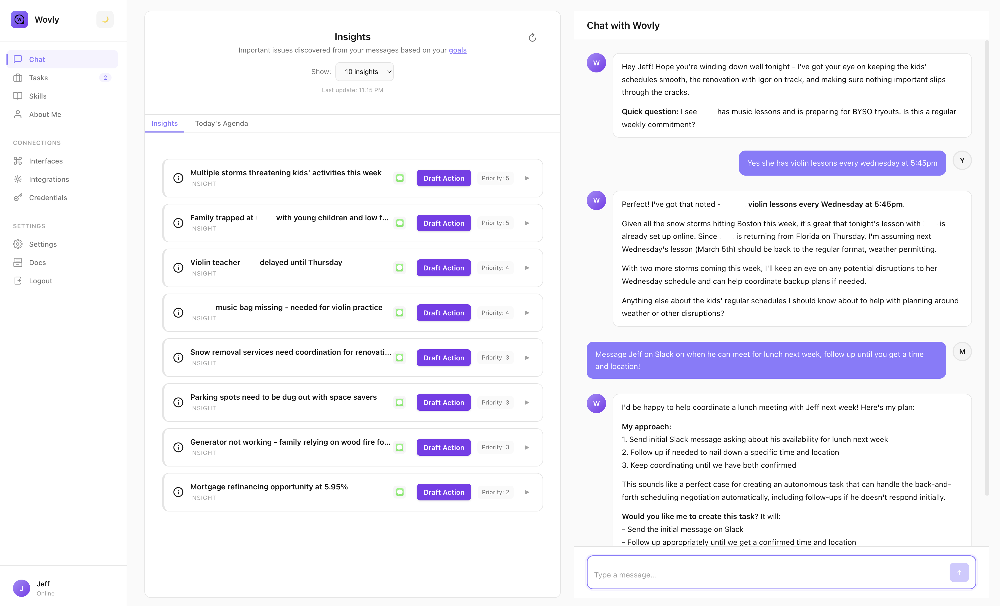
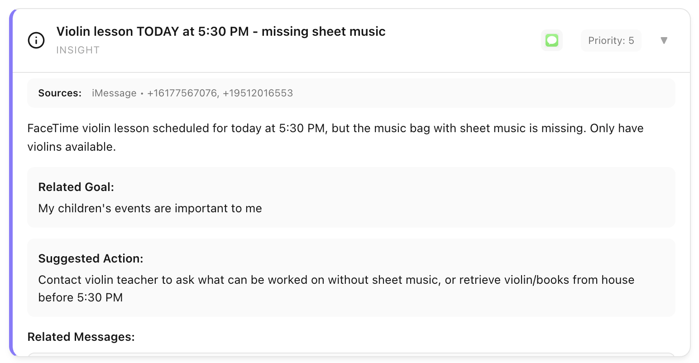
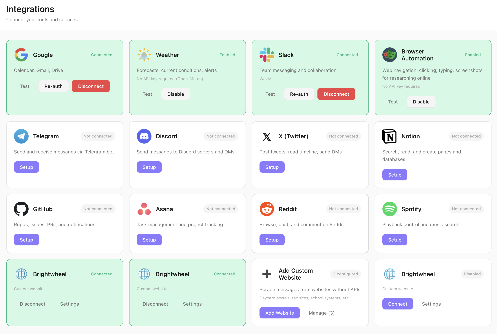
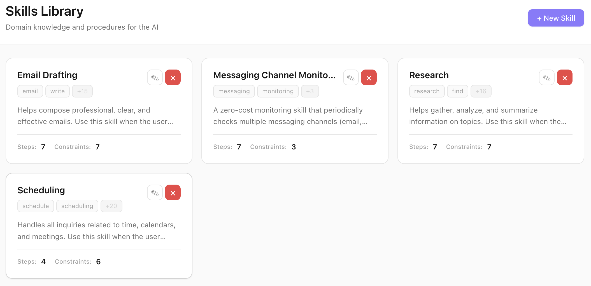
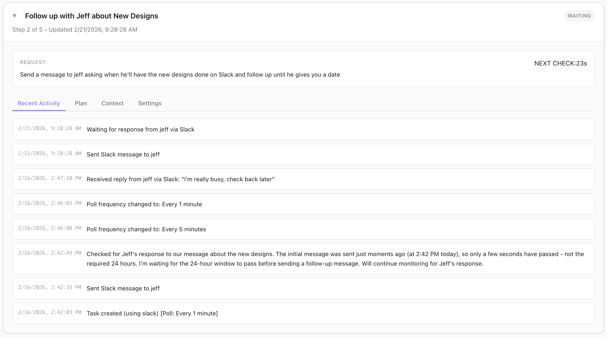

# Wovly

**Your Autonomous Personal AI Communication Assistant**

[](https://opensource.org/licenses/MIT)
[](https://github.com/wovly/wovly)
[](https://github.com/wovly/wovly/issues)
[](https://www.electronjs.org/)
[](https://wovly.mintlify.app/)

A privacy-first desktop AI communication assistant that manages your contacts, follow ups, chat analysis, and remembers context across Email, Slack, iMessage, WhatsApp, Telegram, and more.

> **🚧 Beta Notice:** Wovly is currently in beta. We appreciate your feedback! Please [report bugs and request features](https://github.com/wovly/wovly/issues) on GitHub.
>
> **Platform Support:** Currently macOS only. Windows and Linux support coming soon.

<p align="center">
  
</p>

---

## Features

### 👤 About Me & Goals

<p align="center">
  
</p>

Your profile and goals are the foundation of Wovly's intelligence:

- **Goal-Driven Filtering** – Your active goals determine what's important and what's noise
- **Priority Intelligence** – Messages related to your goals automatically get higher priority
- **Context Engine** – Profile provides essential context for every interaction
- **VIP Management** – Define who matters most for instant prioritization
- **Editable Profile** – Simple markdown file you can customize completely
- **Privacy First** – All profile data stored locally, never sent to cloud

**How it works:** Your goals act as the primary filter for extracting insights. When you set a goal like "Launch product by March 15", Wovly prioritizes all messages related to launches, deadlines, and relevant people. Without goals, you'd get 100+ notifications daily. With goals, you get 3-10 actionable insights focused on what matters.

[Learn more about About Me & Goals →](./apps/desktop/docs/features/ABOUT_ME.md)

### 📊 Smart Insights

<p align="center">
  
</p>

Wovly automatically analyzes your messages across all platforms and surfaces important information:

- **Conflict Detection** – Identifies scheduling conflicts and conflicting information
- **Follow-up Tracking** – Reminds you of pending responses and action items
- **Miscommunication Alerts** – Flags potential misunderstandings before they escalate
- **Priority Scoring** – Ranks insights by urgency (1-5) so you focus on what matters
- **Multi-source Analysis** – Consolidates insights from Gmail, Slack, iMessage, and custom websites
- **Smart Filtering** – Shows only the most relevant insights based on your goals and context

**How it works:** Every hour, Wovly analyzes new messages using AI to extract facts and detect patterns. Insights are generated by cross-referencing messages with your profile, goals, and calendar.

[Learn more about Insights →](./apps/desktop/docs/features/INSIGHTS.md)

### 🔗 Powerful Integrations

<p align="center">
  
</p>

Connect your favorite tools and platforms:

- **Email & Calendar** – Gmail, Google Calendar
- **Messaging** – iMessage, Slack, WhatsApp, Telegram, Discord
- **Productivity** – Notion, GitHub, Asana, Reddit, Spotify
- **Custom Websites** – Scrape messages from any website without an API (daycare portals, tax sites, school systems)
- **Browser Automation** – Navigate websites, extract data, fill forms

**Smart Web Scraping:** Extract messages from sites like Brightwheel, tax portals, or custom internal tools using AI-powered selector detection with visual refinement.

[Learn more about Integrations →](./apps/desktop/docs/features/INTEGRATIONS.md)

### 💬 Multi-Platform Chat

<p align="center">
  
</p>

Natural language control from anywhere:

- **Desktop Chat** – Main interface with full capabilities
- **WhatsApp Interface** – Chat with Wovly remotely from your phone
- **Telegram Bot** – Run commands and get notifications on the go
- **Context-Aware** – Remembers preferences, goals, and conversation history
- **Streaming Responses** – See answers as they're generated

**Example Commands:**
- "What's on my calendar today?"
- "Send an email to Sarah about the meeting"
- "What did the daycare say this week?" (from custom web integration)

[Learn more about Chat Interfaces →](./apps/desktop/docs/features/INTERFACES.md)

### 🎯 Customizable Skills

<p align="center">
  
</p>

Create custom behaviors and automate repetitive workflows:

- **Trigger-Based Actions** – Define "when X happens, do Y" workflows
- **Custom Instructions** – Teach Wovly how to handle specific scenarios
- **Multi-step Procedures** – Chain multiple actions together
- **Natural Language Creation** – Describe skills in plain English

**Examples:**
- "When I say 'marco', respond with 'polo'"
- "If someone mentions 'urgent' in Slack, notify me immediately"
- "Every morning, summarize yesterday's important emails"

[Learn more about Skills →](./apps/desktop/docs/features/SKILLS.md)

### 📋 Automated Tasks

<p align="center">
  
</p>

Background workflows with intelligent execution:

- **Scheduled Tasks** – Run at specific times or intervals (hourly, daily, weekly)
- **Event-Driven Tasks** – Trigger on login, new messages, calendar events
- **Multi-step Execution** – Complex workflows with branching logic
- **Tool Integration** – Access all connected platforms (Gmail, Slack, etc.)
- **Smart Scheduling** – Automatic retry on failure, skip on holidays

**Examples:**
- "Remind me to eat lunch at 12pm tomorrow"
- "Every Friday at 5pm, send weekly summary to team"
- "Monitor emails from boss every 15 minutes"

[Learn more about Tasks →](./apps/desktop/docs/features/TASKS.md)

### 🔒 Privacy-First Architecture

- **Local Storage** – App data stored on your machine, not in the cloud
- **Encrypted Credentials** – OS-level encryption via Keychain/DPAPI/libsecret
- **No Tracking** – No analytics, no telemetry, no data collection
- **Multi-User Support** – Per-user data isolation for shared computers
- **Direct API Calls** – Your data goes directly to your chosen LLM provider

---

## Integrations

| Integration | Capabilities |
|-------------|-------------|
| **Google Workspace** | Gmail read/write, Calendar management, event creation |
| **Slack** | Send messages, read channels, search DMs, user lookup |
| **iMessage** | Send/read texts, contact resolution (macOS only) |
| **WhatsApp** | Two-way messaging, remote control interface |
| **Telegram** | Bot interface, remote commands, notifications |
| **Discord** | Server messaging, channel management |
| **Asana** | Task management, project tracking |
| **Notion** | Page access, database queries |
| **GitHub** | Repository access, issue tracking |
| **Reddit** | Browse posts, read comments |
| **Spotify** | Playback control, music search |
| **Browser Automation** | Web navigation, form filling, data extraction |

---

## LLM Providers

Choose your preferred AI model:

| Provider | Models |
|----------|--------|
| **Anthropic** | Claude Sonnet 4, Claude Haiku, Claude Opus |
| **OpenAI** | GPT-4o, GPT-4 Turbo, GPT-4o Mini |
| **Google** | Gemini 1.5 Pro, Gemini 1.5 Flash |

---

## Use Cases

### Scheduling & Coordination
```
"Schedule a meeting with John next week"
→ Emails John, negotiates times, checks your calendar, creates the event

"Text my wife to coordinate kid pickup today"
→ Converses to align schedules and confirms the plan

"Chris sent me a calendar link in Slack. Find a time and book it"
→ Opens the link, cross-references your calendar, completes booking
```

### Communication & Research
```
"Based on the PRD and recent Slack messages, write an update to the sales team"
→ Synthesizes context and drafts a personalized message

"Email the top 3 candidates and ask about availability"
→ Sends personalized outreach and tracks responses

"Scan the sales channel conversations over the past 30 days and provide insights on how I can help"
→ Process all the of the chat and historical context to generate actional insights
```

### Web Automation
```
"Go to LinkedIn and get the profile summary of [person]"
→ Navigates and extracts the information

"Check flight prices from Boston to Miami on Google Flights"
→ Browses the site and reports options

"Fill out the contact form on [website] with my information"
→ Navigates, fills fields, and submits
```

### Monitoring & Alerts
```
"Monitor the weather and alert me if it's going to rain"
→ Checks periodically and notifies before rain

"Watch my inbox for emails from [client] and summarize immediately"
→ Monitors and alerts in real-time
```

### Remote Access (via WhatsApp/Telegram)
```
[WhatsApp] "Any important emails today?"
→ Get summaries and updates on your phone from anywhere

[Telegram] "Create a task to remind me to call mom at 5pm"
→ Create and manage tasks remotely

[WhatsApp] "Text my wife I'm running 10 min late"
→ Send messages across platforms from your phone
```

---

## Installation

### Prerequisites

- **macOS** 10.15 (Catalina) or later
- **Node.js** 18+
- API key for at least one LLM provider

### Quick Start

```bash
# Clone the repository
git clone https://github.com/wovly/wovly.git
cd wovly

# Install dependencies
npm install

# Start the application (from root directory!)
npm run dev
```

> **Note:** `npm run dev` must be run from the **root** `wovly/` directory, not from a subdirectory. This command starts both the UI dev server (Vite on port 5173) and the Electron app simultaneously.

### Configuration

#### 1. LLM API Keys

Go to **Settings** → **AI Providers** and add your API keys:

| Provider | Get API Key |
|----------|-------------|
| Anthropic | https://console.anthropic.com/ |
| OpenAI | https://platform.openai.com/api-keys |
| Google | https://aistudio.google.com/app/apikey |

#### 2. Google Workspace

1. Go to [Google Cloud Console](https://console.cloud.google.com/)
2. Create a new project
3. Enable **Gmail API** and **Google Calendar API**
4. Create OAuth 2.0 credentials (Desktop app)
5. In Wovly: **Integrations** → **Google Workspace** → Enter Client ID & Secret

#### 3. Slack

1. Go to [Slack API Apps](https://api.slack.com/apps)
2. Create a new app "From scratch"
3. Add **User Token Scopes**:
   - `channels:history`, `channels:read`, `chat:write`
   - `groups:history`, `groups:read`, `im:history`, `im:read`, `im:write`
   - `users:read`
4. In Wovly: **Integrations** → **Slack** → Follow setup wizard

#### 4. iMessage (macOS only)

- Works automatically on macOS
- Grant Contacts access when prompted
- Full Disk Access may be required for message history

#### 5. Other Integrations

Configure WhatsApp, Telegram, Discord, and other integrations from the **Integrations** page in the app.

---

## Architecture

```
wovly/
├── apps/
│   ├── desktop/              # Electron main process
│   │   ├── main.js           # Core logic, IPC handlers, integrations
│   │   └── preload.js        # IPC bridge to renderer
│   └── ui/                   # React frontend
│       └── src/
│           ├── App.tsx       # Main UI components
│           └── styles.css
├── packages/                 # Shared modules
│   ├── agent-core/
│   ├── memory/
│   ├── integrations/
│   ├── llm/
│   ├── scheduler/
│   └── tools/
├── docs/                     # Documentation (Mintlify)
└── ~/.wovly-assistant/       # User data (outside repo)
    ├── users.json            # User registry
    └── users/
        └── {username}/       # Per-user isolated data
            ├── settings.json # API keys, tokens
            ├── credentials.enc # Encrypted credentials
            ├── memory/       # Daily logs, long-term memory
            ├── tasks/        # Active and completed tasks
            ├── skills/       # Custom skill definitions
            ├── profiles/     # User profile data
            └── browser-data/ # Per-user browser sessions
```

---

## Privacy & Security

- **App data stored locally** – Profiles, tasks, skills, and credentials stay on your device
- **Chat prompts sent to LLMs** – Your conversations are sent to your chosen provider (Anthropic, OpenAI, or Google) via their APIs
- **No Wovly servers** – Direct API calls to providers, nothing passes through us
- **Per-user isolation** – Each user's data is completely separated
- **Encrypted credentials** – OS-level encryption (Keychain/DPAPI/libsecret)
- **Local browser automation** – Chromium runs on your machine

---

## Documentation

Full documentation available at: **[docs.wovly.dev](https://wovly.mintlify.app/)** 

Or browse the `/docs` directory for:
- [Installation Guide](docs/installation.mdx)
- [Features](docs/features/)
- [Integrations](docs/integrations/)
- [Architecture Reference](docs/reference/architecture.mdx)
- [Security](docs/reference/security.mdx)
- [Troubleshooting](docs/reference/troubleshooting.mdx)

---

## Development

**Important:** All commands should be run from the **root** `wovly/` directory.

```bash
# Development mode (runs UI + Electron together)
npm run dev

# Build for production
npm run build

# Run linter
npm run lint
```

### Troubleshooting Development

If `npm run dev` fails or the app window doesn't open:

```bash
# 1. Make sure you're in the root directory
pwd  # Should show /path/to/wovly

# 2. Kill any lingering processes from previous runs
pkill -f "vite" ; pkill -f "electron"

# 3. If port 5173 is in use, kill that process
lsof -ti:5173 | xargs kill -9

# 4. Try again
npm run dev
```

### Running Components Separately

If needed, you can run the UI and Electron separately in two terminals:

```bash
# Terminal 1: Start UI dev server
cd apps/ui && npm run dev

# Terminal 2: Start Electron (after UI is running)
cd apps/desktop && npm run dev
```

---

## Feedback & Bug Reports

Wovly is in **beta** and we'd love your feedback! Help us improve by reporting issues on GitHub.

### Filing an Issue

1. Go to [GitHub Issues](https://github.com/wovly/wovly/issues)
2. Click **New Issue**
3. Choose a template:
   - **Bug Report** – Something isn't working
   - **Feature Request** – Suggest an improvement
4. Provide as much detail as possible

### What to Include

For bug reports:
- Steps to reproduce the issue
- Expected vs actual behavior
- macOS version and Wovly version
- Console logs (Cmd + Option + I → Console tab)

For feature requests:
- Clear description of the desired functionality
- Use case explaining why it would be helpful

---

## Contributing

Contributions are welcome! Please read our contributing guidelines before submitting PRs.

1. Fork the repository
2. Create a feature branch (`git checkout -b feature/amazing-feature`)
3. Commit your changes (`git commit -m 'Add amazing feature'`)
4. Push to the branch (`git push origin feature/amazing-feature`)
5. Open a Pull Request

---

## License

MIT License - see [LICENSE](LICENSE) for details.

---

## Acknowledgments

Built with:
- [Electron](https://www.electronjs.org/) – Desktop framework
- [React](https://reactjs.org/) – UI library
- [TypeScript](https://www.typescriptlang.org/) – Type safety
- [Puppeteer](https://pptr.dev/) – Browser automation
- [Mintlify](https://mintlify.com/) – Documentation

---

**Questions?** Open an issue or check the [FAQ](docs/reference/faq.mdx).
