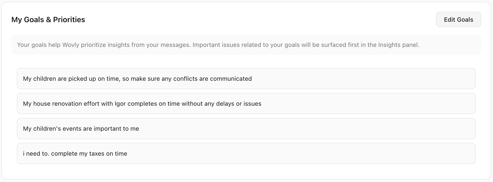

# About Me & Goals

<p align="center">
  
</p>

## Overview

The "About Me" section is the foundation of Wovly's intelligence. Your profile and goals act as the **primary filter** for extracting insights from all your integrations. By understanding who you are, what you're working on, and what matters to you, Wovly can prioritize the right information and ignore the noise.

## How Goals Drive Insights

### The Insight Filtering Process

```
All Messages (100s/day) → Goal Filter → Relevant Messages (10-20) → Insights (3-10)
```

**Without goals:**
- Generic analysis of all messages
- No context about what's important
- Low-priority items mixed with critical ones
- 50+ insights daily (overwhelming)

**With goals:**
- Focused analysis based on your priorities
- Context-aware prioritization
- Critical items highlighted, noise filtered
- 3-10 actionable insights daily

### Example Scenario

**Your Goal:**
```
Launch Q1 product feature by March 15th
```

**Messages received:**
1. ✅ **Email from engineering:** "API integration blocked" → **Priority 5 insight** (directly related to launch)
2. ✅ **Slack from PM:** "Design review scheduled for Friday" → **Priority 4 insight** (launch prep)
3. ❌ Email from HR: "Update your emergency contact" → **Filtered out** (not related to goal)
4. ❌ Slack in #random: "Who wants lunch?" → **Filtered out** (social, not priority)
5. ✅ **Calendar:** "Product demo meeting conflicts with engineering sync" → **Priority 5 insight** (launch conflict)

**Result:** 3 actionable insights instead of 5 notifications, all focused on your goal.

## Goals as Priority Signals

### How Wovly Uses Goals

**1. Keyword Matching**
If your goal mentions "product launch", messages containing:
- "launch"
- "release"
- "deploy"
- "go-live"
- "product"

...are automatically prioritized.

**2. People Matching**
If your goal mentions working with "Sarah" or "engineering team":
- Messages from Sarah → higher priority
- Messages in #engineering channel → analyzed
- Messages from unrelated people → deprioritized

**3. Timeline Matching**
If your goal has a deadline (March 15th):
- Messages 2 weeks before deadline → priority 4-5
- Messages 1 week before → priority 5 (critical)
- Conflicting calendar events near deadline → flagged

**4. Topic Clustering**
Wovly groups related messages:
- Multiple emails about "API integration" → consolidated into single insight
- Scattered Slack messages about same topic → summarized together
- Reduces clutter, increases clarity

### Priority Scoring Logic

Goals directly influence the 1-5 priority scale:

**Priority 5 (Critical) - Generated when:**
- Message directly mentions goal keyword + deadline approaching
- Conflict detected that blocks goal completion
- VIP (mentioned in goal) sends urgent request

**Priority 4 (High) - Generated when:**
- Message relates to goal topic
- Decision point that affects goal timeline
- Follow-up needed from goal-related contact

**Priority 3 (Medium) - Generated when:**
- Tangentially related to goal
- General updates from goal contacts
- Background information useful for goal

**Priority 2-1 (Low) - Generated when:**
- Not related to any active goals
- Social/informational only
- Can be safely ignored

## Your Profile: The Context Engine

Your profile (`profile.md`) provides essential context that enhances every interaction with Wovly.

### What's in Your Profile

**1. Basic Information**
- Name, role, company
- Contact information
- Location and timezone

**2. Work Context**
- Current projects
- Team members and their roles
- Key stakeholders and VIPs

**3. Active Goals**
- What you're working toward
- Deadlines and milestones
- Success criteria

**4. Preferences**
- Communication style
- Working hours
- Notification preferences

**5. Important Contacts**
- Who to prioritize (boss, clients, family)
- Who to filter (newsletters, marketing)
- Special handling rules

### Example Profile.md

```markdown
# Profile: Jeff Chou

## Basic Information
- **Name:** Jeff Chou
- **Role:** Senior Product Manager
- **Company:** TechCorp Inc.
- **Email:** jeff@techcorp.com
- **Phone:** +1 (555) 123-4567
- **Location:** San Francisco, CA
- **Timezone:** America/Los_Angeles

## Current Projects

### Q1 Product Launch (Primary Focus)
- **Goal:** Launch new API integration feature by March 15, 2026
- **Status:** In development, 60% complete
- **Team:** 3 engineers, 1 designer, 1 QA
- **Stakeholders:** VP Product (Sarah), CEO, Customer Success team
- **Blockers:** Third-party API documentation incomplete
- **Key Metrics:** 100 beta users signed up, 85% satisfaction target

### Customer Onboarding Improvements (Secondary)
- **Goal:** Reduce onboarding time from 2 weeks to 1 week
- **Status:** Planning phase
- **Team:** UX designer (Maria), Customer Success (Tom)
- **Timeline:** Q2 2026

## Team & Contacts

### Direct Reports
- **Alex Chen** - Senior Engineer (alex@techcorp.com)
  - Working on API backend
  - Slack: @alex
- **Maria Rodriguez** - UX Designer (maria@techcorp.com)
  - Design lead for new features
  - Slack: @maria
- **Tom Williams** - QA Lead (tom@techcorp.com)
  - Testing coordinator
  - Slack: @tom

### Key Stakeholders (VIPs - Priority 5)
- **Sarah Johnson** - VP Product (sarah@techcorp.com)
  - My direct manager
  - Weekly 1-on-1s Thursdays 2pm
  - ALWAYS prioritize her messages
- **David Park** - CEO (david@techcorp.com)
  - Quarterly check-ins
  - Priority emails
- **Lisa Brown** - Customer Success Director (lisa@techcorp.com)
  - Key partner for launch
  - Daily coordination needed

### Important External Contacts
- **John Smith** - Beta Customer, Acme Corp (john@acme.com)
  - Priority beta tester
  - Feedback critical for launch
- **Emily Davis** - Third-party API Partner (emily@apipartner.com)
  - Dependency for our launch
  - Track all communications

### Family (Personal Priority 5)
- **Jane Chou** - Wife (+1-555-123-9999)
  - iMessage, respond immediately
- **Brightwheel (Teacher Sarah)** - Daycare updates
  - Daily check required
  - Action items time-sensitive

## Active Goals (Q1 2026)

### 1. Launch API Integration Feature
**Deadline:** March 15, 2026
**Priority:** Critical (5)
**Success Criteria:**
- 100% test coverage
- 100 beta users onboarded
- < 50ms API response time
- Zero critical bugs
- Positive feedback from 85% of beta users

**Related Keywords:**
- API, integration, launch, release, beta, testing, deployment
- Third-party, partner API, authentication, endpoints

**Weekly Milestones:**
- Week of Feb 24: Complete API authentication flow
- Week of Mar 3: Beta testing begins
- Week of Mar 10: Bug fixes and polish
- Week of Mar 17: Production launch

**Blockers to Monitor:**
- API partner documentation delays
- Engineering resource conflicts
- Customer Success bandwidth for beta support

### 2. Prepare Q2 Roadmap Presentation
**Deadline:** March 30, 2026
**Priority:** High (4)
**Success Criteria:**
- Presentation deck approved by Sarah
- Data gathered from Q1 metrics
- Team feedback incorporated

**Related Keywords:**
- Q2, roadmap, planning, presentation, strategy

### 3. Maintain Work-Life Balance
**Ongoing**
**Priority:** Medium (3)
**Success Criteria:**
- No work emails after 7pm weekdays
- Full disconnect on weekends
- Daily family dinner at 6pm
- Exercise 3x per week

**Related Keywords:**
- Balance, health, family, exercise, personal

## Work Preferences

### Communication Style
- **Preferred:** Direct, concise updates with action items
- **Avoid:** Long email threads, unnecessary meetings
- **Response Time:** Within 2 hours during work hours (9am-6pm)
- **After Hours:** Only for critical issues related to active goals

### Working Hours
- **Standard:** Monday-Friday, 9am-6pm PST
- **Focused Time:** Tuesday/Thursday mornings (no meetings)
- **Meetings:** Prefer afternoons
- **Lunch:** 12pm-1pm (block calendar)

### Notification Preferences
- **Email:** Check hourly during work hours
- **Slack:** Real-time during work hours, muted after 7pm
- **iMessage:** Always on for family, work after-hours only for VIPs
- **WhatsApp:** Personal only

### Priority Rules
1. **Immediate notification (Priority 5):**
   - Messages from Sarah (VP Product)
   - Messages from wife (Jane)
   - Production incidents
   - Launch blockers
   - Daycare updates requiring action

2. **Hourly digest (Priority 4):**
   - Messages from direct reports
   - Customer feedback on beta
   - Calendar conflicts
   - Goal-related updates

3. **Daily summary (Priority 3):**
   - General team updates
   - Non-urgent stakeholder emails
   - Background project information

4. **Filter out (Priority 1-2):**
   - Marketing emails
   - Social media notifications
   - Non-goal-related newsletters
   - Automated system alerts (unless errors)

## Communication Patterns

### Email Management
- **Morning routine:** Review overnight emails 9-9:30am
- **Inbox zero goal:** End each day with <10 unread
- **Folders:**
  - `Launch` - Anything API integration related
  - `Team` - Direct reports
  - `Stakeholders` - VIP communications
  - `Customers` - Beta testers and users
- **Auto-archive:** Newsletters, receipts, automated reports

### Slack Strategy
- **Active channels:** #engineering, #product, #launch-team
- **Muted channels:** #random, #general, #announcements
- **DMs:** Always read from VIPs and direct reports
- **Status:** "Focused" during Tuesday/Thursday mornings

### Meeting Philosophy
- **Default to 30 min** instead of 60 min
- **Agenda required** or decline
- **Async when possible** (Slack/email vs meeting)
- **No meetings Friday afternoons** (planning time)

## Personal Context

### Daily Routine
- **6:30am:** Wake up, check urgent messages
- **7:00am:** Family breakfast
- **8:00am:** Daycare drop-off
- **9:00am:** Work starts (email review)
- **12:00pm:** Lunch break
- **6:00pm:** Work ends
- **6:30pm:** Family dinner
- **8:00pm:** Kids bedtime
- **9:00pm:** Personal time / catch up if needed

### Important Dates
- **March 15, 2026:** Product launch (CRITICAL)
- **March 30, 2026:** Q2 roadmap presentation
- **April 10-15, 2026:** Family vacation (fully offline)
- **Weekly:** Thursday 2pm - Sarah 1-on-1
- **Weekly:** Friday 4pm - Team retro

### Constraints
- **Daycare pickup:** Must leave by 5:30pm on Tuesdays (backup pickup day)
- **No travel:** March 1-20 (critical launch period)
- **PTO planned:** April 10-15 (family vacation - no work)

## Learning & Development

### Skills I'm Building
- API design patterns
- Data-driven product decisions
- Technical writing for documentation

### Topics I Follow
- Product management best practices
- SaaS metrics and analytics
- API-first product design

### Resources I Check Regularly
- Product Hunt (daily)
- HackerNews (weekly)
- ProductCoalition blog (weekly)

## Notes for Wovly

### Things I Often Forget
- Lunch (remind me at 12pm weekdays)
- 1-on-1 prep (remind me day before)
- Weekly team update email (remind Friday 4pm)
- Birthday wishes for team members (calendar + reminder)

### Automation Opportunities
- **Weekly summary:** Every Friday 5pm - compile week's progress for Sarah
- **Daily standup:** Every morning 9:30am - summarize what I'll work on today
- **Beta user outreach:** When new feedback received, draft thank-you response
- **Meeting prep:** 15 min before meetings, pull relevant Slack/email context

### Context I Need
- When someone mentions "the launch" → they mean API integration (March 15)
- When Sarah asks "status" → she wants API launch status update
- When customer emails → check if they're beta user (prioritize differently)
- When Alex says "blocker" → high priority, likely needs escalation

## Version History
- **Created:** January 15, 2026
- **Last Updated:** February 21, 2026
- **Next Review:** March 1, 2026 (post-launch update)
```

## How to Use Your Profile

### 1. Initial Setup

When you first set up Wovly:
1. Go to **About Me** tab in sidebar
2. Click **Edit Profile**
3. Fill in basic information (name, role, email)
4. Add 1-2 active goals to start
5. List key contacts (VIPs)
6. Save

Wovly immediately starts using this context for insights.

### 2. Regular Updates

**Update your profile when:**
- ✅ Starting a new project or goal
- ✅ Goal deadlines change
- ✅ New team members join
- ✅ Priorities shift
- ✅ Contact information changes

**Recommended frequency:** Weekly review, update as needed.

**Quick update via chat:**
```
You: Add a new goal: "Hire senior engineer by April 1st"

Wovly: ✓ Goal added to your profile:
       - Goal: Hire senior engineer by April 1st
       - Priority: Will now track recruiting emails, candidate messages

       Want me to start monitoring for recruiting-related updates?
```

### 3. Goal Management

**Add goals:**
- Via chat: "Add goal: [description]"
- Via About Me page: Click "Add Goal"
- Edit profile.md directly

**Complete goals:**
```
You: Mark "Q1 Product Launch" as complete

Wovly: ✓ Goal marked complete!
       - Insights related to this goal will be archived
       - Would you like a summary of all insights from this goal?
```

**Archive vs Delete:**
- **Archive:** Keep history for reference, stop generating insights
- **Delete:** Remove completely (use for mistakes/irrelevant goals)

### 4. Contact Priority Rules

**VIP contacts** (Priority 5 - immediate notification):
```markdown
### VIPs
- Sarah Johnson (boss) - sarah@company.com
- Jane Chou (wife) - +1-555-123-9999
```

**Important contacts** (Priority 4 - hourly digest):
```markdown
### Important
- Direct reports (Alex, Maria, Tom)
- Key customers (John Smith - Acme Corp)
```

**Standard contacts** (Priority 3 - daily summary):
Everyone else in your organization.

**Low priority** (Priority 1-2 - filter aggressively):
```markdown
### Low Priority / Filter
- marketing@newsletter.com
- noreply@automated.com
- #random Slack channel
```

## Advanced Profile Features

### Dynamic Goal Prioritization

Goals automatically adjust priority based on deadlines:

**Example:**
```markdown
Goal: Launch product by March 15
```

- **Feb 21 (3 weeks out):** Priority 4
- **Mar 1 (2 weeks out):** Priority 4-5
- **Mar 8 (1 week out):** Priority 5 (everything related is critical)
- **Mar 16 (after deadline):** Priority 2 (archive or extend)

### Keyword Expansion

Wovly automatically expands your goal keywords:

**Your goal mentions:** "API integration"

**Wovly also tracks:**
- "API"
- "integration"
- "endpoint"
- "authentication"
- "third-party"
- Related acronyms (REST, GraphQL, etc.)

### Relationship Mapping

When you mention people in your profile, Wovly learns relationships:

```markdown
Sarah Johnson - VP Product - my manager
Alex Chen - Senior Engineer - reports to me
John Smith - Beta Customer - Acme Corp
```

**Wovly understands:**
- Sarah outranks me (her messages are VIP)
- Alex reports to me (I should respond to blockers)
- John is external customer (feedback is gold)

### Context Threading

Profile helps Wovly connect related messages:

**Email from Sarah:** "How's the launch going?"
**Slack from Alex:** "API tests failing"
**Daycare:** "Field trip Friday"

**Without profile:** 3 separate items
**With profile:**
- Email + Slack = **Priority 5 insight** ("Launch blocker: API tests failing. Sarah asking for status.")
- Daycare = **Priority 4** (Friday is launch day, potential conflict)

## Profile Privacy

**What's in your profile:**
- Stored locally: `~/.wovly-assistant/users/{username}/profiles/profile.md`
- Never sent to cloud
- Encrypted at rest (OS-level encryption)

**What's sent to LLMs:**
- Goal keywords for context
- VIP list for prioritization
- NOT your full profile (only relevant snippets)

**Example LLM prompt:**
```
User's active goals:
- Launch API integration by March 15
- Hire senior engineer by April 1

VIP contacts: Sarah Johnson (manager)

Analyze these 5 messages and generate insights.
```

Your full profile stays on your machine.

## Best Practices

### 1. Be Specific with Goals

**Bad:**
```
Goal: Do better at work
```

**Good:**
```
Goal: Launch API integration feature by March 15, 2026
- 100 beta users onboarded
- 85% satisfaction rate
- Zero critical bugs
```

Specific goals → better filtering → more relevant insights.

### 2. Update Goals Regularly

Set a weekly reminder:
- Review active goals
- Update progress
- Add new goals
- Archive completed goals

Stale goals → incorrect prioritization.

### 3. Include Deadlines

**With deadline:**
```
Goal: Hire senior engineer by April 1, 2026
```
→ Wovly increases urgency as deadline approaches

**Without deadline:**
```
Goal: Hire senior engineer someday
```
→ Wovly treats as low priority

### 4. Name Your VIPs

Explicitly list people who matter:
```markdown
VIPs:
- Sarah Johnson (boss) - ALWAYS priority 5
- Jane Chou (wife) - ALWAYS priority 5
- David Park (CEO) - Priority 5
```

Wovly will never miss their messages.

### 5. Use Keywords Liberally

The more keywords you include, the better the filtering:

**Good:**
```
Goal: Launch API integration
Keywords: API, integration, REST, GraphQL, endpoints,
          authentication, third-party, partner, beta, testing
```

### 6. Document Your Routine

Help Wovly understand your schedule:
```markdown
Daily Routine:
- 9am: Email review
- 12pm: Lunch
- 6pm: Work ends
- No meetings Tuesday/Thursday mornings
```

Wovly can schedule reminders and avoid bad timing.

### 7. Explain Abbreviations

If your team uses acronyms, define them:
```markdown
Context:
- "Q1 Launch" = API integration feature launch March 15
- "Sarah" = Sarah Johnson, VP Product, my manager
- "TPS reports" = Weekly progress updates for stakeholders
```

Wovly will understand shorthand in messages.

## Troubleshooting

### Too Many Insights

**Problem:** Getting 20+ insights daily (overwhelming)

**Solution:**
1. Add more specific goals (too generic = too many matches)
2. Reduce number of active goals (3-5 max recommended)
3. Increase priority threshold (only show 4-5)
4. Add more items to low-priority filter list

### Missing Important Insights

**Problem:** Critical message not flagged

**Solution:**
1. Add sender to VIP list
2. Add related keywords to goals
3. Check if goal deadline is set correctly
4. Verify integration is connected (Gmail, Slack, etc.)

### Wrong Prioritization

**Problem:** Low-priority items marked urgent

**Solution:**
1. Review goal keywords (too broad?)
2. Check VIP list (too many VIPs?)
3. Update contact priority rules
4. Clarify goal specificity

### Profile Not Loading

**Problem:** Changes to profile.md not reflected

**Solution:**
1. Save file and wait 30 seconds (auto-reload)
2. Restart Wovly app
3. Check file location: `~/.wovly-assistant/users/{username}/profiles/profile.md`
4. Verify markdown syntax (use validator)

## Related Documentation

- [Insights](./INSIGHTS.md) - How goals drive insight generation
- [Skills](./SKILLS.md) - Create goal-based skills
- [Tasks](./TASKS.md) - Automate goal-related workflows
- [Integrations](./INTEGRATIONS.md) - Connect platforms for comprehensive analysis

## Support

For profile and goal questions:
- [GitHub Issues](https://github.com/wovly/wovly/issues)
- [FAQ](../reference/faq.mdx)
- [Profile Examples Repository](https://github.com/wovly/wovly-profiles)
