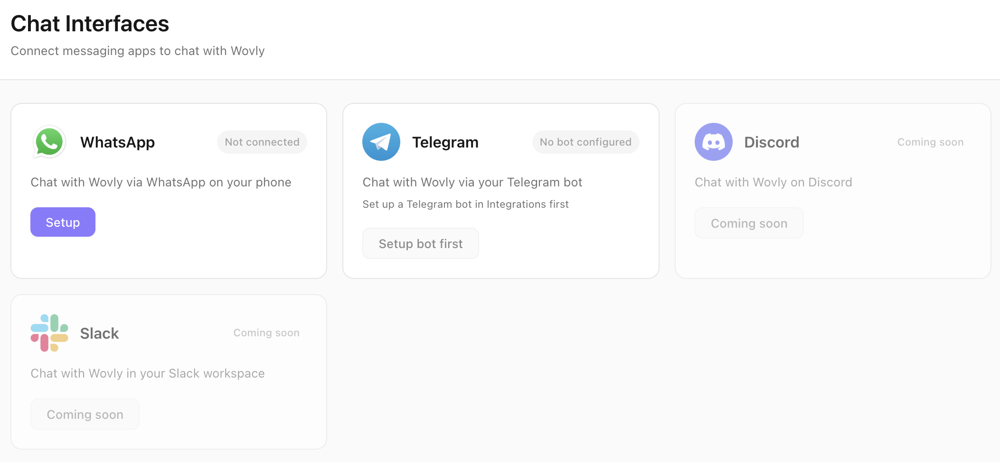

# Multi-Platform Chat Interfaces

<p align="center">
  
</p>

## Overview

Wovly provides multiple chat interfaces so you can interact with your AI assistant from anywhere - at your desk, on your phone, or remotely. All interfaces share the same context, memory, and capabilities, giving you seamless access to your emails, calendar, messages, and tasks regardless of how you connect.

## Available Interfaces

### Desktop Chat (Primary Interface)

The main Wovly desktop application provides the richest chat experience with full access to all features.

**Capabilities:**
- 💬 **Full conversational AI** with streaming responses
- 🔧 **All tool integrations** (Gmail, Slack, iMessage, browser, etc.)
- 📊 **Visual displays** for calendar events, email threads, task lists
- 📎 **File attachments** and screenshot analysis
- 🎨 **Rich formatting** with markdown support
- 📝 **Code blocks** with syntax highlighting
- 🔍 **Searchable history** of all conversations

**Usage:**
1. Open Wovly desktop app
2. Navigate to **Chat** tab in sidebar
3. Type your message or use voice input
4. See responses stream in real-time

**Example Queries:**
```
"What's on my calendar today?"
"Send an email to Sarah about the Q4 report"
"Search my Slack for messages about the product launch"
"What did the daycare say this week?"
"Create a task to follow up with John tomorrow"
```

**Keyboard Shortcuts:**
- `Enter` - Send message
- `Shift + Enter` - New line
- `Cmd/Ctrl + K` - Clear conversation
- `Cmd/Ctrl + L` - Focus input

**Context Awareness:**
Desktop chat has full access to:
- Your profile (name, role, goals, preferences)
- Long-term memory (daily logs, summaries)
- All connected integrations
- Browser automation capabilities
- Local file system access

---

### WhatsApp Interface

Control Wovly remotely from your phone using WhatsApp. Perfect for checking emails, sending messages, or getting quick answers when you're away from your desk.

**Setup:**
1. Go to **Interfaces** tab in Wovly desktop
2. Click **Configure WhatsApp**
3. Scan QR code with WhatsApp mobile app
4. Grant permissions
5. Start chatting with Wovly's WhatsApp number

**Capabilities:**
- 📧 **Email queries** - "Any important emails today?"
- 📅 **Calendar checks** - "What's on my schedule tomorrow?"
- 💬 **Send messages** - "Text my wife I'm running late"
- 🔍 **Search** - "Find the email from John about the budget"
- ✅ **Task management** - "Add a task to call Sarah at 3pm"
- 🤖 **Full AI chat** - Ask questions, get summaries, make requests

**Example Conversations:**

```
You: Any important emails since noon?

Wovly: You have 3 important emails:

1. Sarah Chen (2:15pm) - Q4 Budget Review
   "Need your approval on the updated numbers by EOD"

2. Client Services (1:45pm) - Invoice #4521
   "Payment received, thank you"

3. John Martinez (1:20pm) - Meeting Reschedule
   "Can we move our 4pm to tomorrow at 10am?"

Would you like me to respond to any of these?
```

```
You: Text my wife I'm running 10 minutes late

Wovly: Sent via iMessage to Jane Doe:
"Hey, I'm running about 10 minutes late. See you soon!"

Message delivered ✓
```

```
You: Create a task to follow up with Sarah tomorrow at 2pm

Wovly: Task created:
📋 Follow up with Sarah
⏰ Tomorrow at 2:00pm
✓ Reminder will be sent
```

**Response Format:**
WhatsApp interface uses concise, mobile-friendly formatting:
- Short paragraphs
- Bullet points for lists
- Emojis for visual cues
- Action confirmations

**Security:**
- **Phone number allowlist** - Only your number(s) can interact
- **Session timeout** - Auto-logout after 24 hours of inactivity
- **Encryption** - WhatsApp end-to-end encryption
- **No credential exposure** - Never sends passwords or API keys

**Configuration:**
```json
{
  "whatsapp": {
    "enabled": true,
    "allowedNumbers": ["+1234567890"],
    "sessionTimeout": 86400000,
    "allowSensitiveActions": false,
    "requireConfirmation": true
  }
}
```

**Limitations:**
- No file uploads (text only)
- No browser automation
- Cannot modify system settings
- Rate limited (10 messages per minute)

---

### Telegram Bot Interface

A Telegram bot interface for power users who prefer Telegram's speed and features.

**Setup:**
1. Go to **Interfaces** tab in Wovly desktop
2. Click **Configure Telegram**
3. Create a bot via [@BotFather](https://t.me/botfather)
4. Enter bot token in Wovly
5. Start conversation with your bot

**Capabilities:**
- All WhatsApp capabilities
- **Inline buttons** for quick actions
- **Document sharing** (PDFs, exports)
- **Photo analysis** (send screenshots for context)
- **Voice messages** (transcription via LLM)
- **Slash commands** for quick access

**Telegram Commands:**
- `/start` - Initialize bot connection
- `/status` - Check Wovly status and integrations
- `/email` - Quick email summary
- `/calendar` - Show today's schedule
- `/tasks` - List active tasks
- `/help` - Show available commands

**Example with Inline Buttons:**

```
You: /email

Wovly: 📧 Email Summary - Feb 21, 2026

Unread: 12 messages
Important: 3 messages

[View Important] [View All] [Compose]

Most recent:
• Sarah Chen - Q4 Budget Review (2:15pm)
• John Martinez - Meeting Reschedule (1:20pm)
• Client Services - Invoice #4521 (1:45pm)
```

Clicking **[View Important]** shows full details with additional actions.

**Advanced Features:**

**Photo Analysis:**
Send a screenshot → Wovly analyzes it
```
You: [sends photo of receipt]
   "Add this to my expenses"

Wovly: Receipt analyzed:
Merchant: Whole Foods
Amount: $47.23
Date: Feb 21, 2026

Added to expenses spreadsheet ✓
Category: Groceries
```

**Voice Messages:**
Send voice note → Wovly transcribes and responds
```
You: [voice message: "What meetings do I have tomorrow?"]

Wovly: 🎤 Transcribed: "What meetings do I have tomorrow?"

You have 3 meetings tomorrow:
• 9:00am - Team Standup (30 min)
• 11:00am - Client Review (1 hour)
• 2:00pm - 1-on-1 with Sarah (30 min)
```

**Configuration:**
```json
{
  "telegram": {
    "enabled": true,
    "botToken": "123456:ABC-DEF...",
    "allowedUserIds": [123456789],
    "enableInlineButtons": true,
    "enableVoice": true,
    "enablePhotos": true
  }
}
```

---

### Discord Server Integration (Experimental)

Run Wovly as a Discord bot in your personal server for team collaboration.

**Setup:**
1. Create Discord application at [Discord Developer Portal](https://discord.com/developers/applications)
2. Create bot and get token
3. Invite bot to server
4. Configure in Wovly: **Interfaces → Discord**

**Use Cases:**
- Team-wide calendar coordination
- Shared task tracking
- Email summaries for team leads
- Collaborative note-taking

**Commands:**
- `!wovly <query>` - Ask Wovly a question
- `!schedule` - Show team calendar
- `!tasks` - Show shared task list

**Limitations:**
- Experimental feature
- Privacy concerns (shared server)
- Limited to text commands

---

## Remote Access Architecture

All interfaces connect to the same Wovly desktop instance:

```
┌─────────────────────────────────────────────┐
│ Wovly Desktop (Main Process)                │
│                                              │
│ ┌────────────────────────────────────────┐  │
│ │ Context Manager                        │  │
│ │ • User profile                         │  │
│ │ • Memory & conversation history        │  │
│ │ • Integration connections              │  │
│ └────────────────────────────────────────┘  │
│                                              │
│ ┌────────────────────────────────────────┐  │
│ │ Tool Executor                          │  │
│ │ • Gmail, Slack, iMessage, etc.         │  │
│ │ • Browser automation                   │  │
│ │ • Task management                      │  │
│ └────────────────────────────────────────┘  │
│                                              │
│ ┌────────────────────────────────────────┐  │
│ │ Interface Handlers                     │  │
│ │ • Desktop UI ←→ Electron renderer      │  │
│ │ • WhatsApp ←→ WhatsApp Web API         │  │
│ │ • Telegram ←→ Telegram Bot API         │  │
│ │ • Discord ←→ Discord Bot API           │  │
│ └────────────────────────────────────────┘  │
└─────────────────────────────────────────────┘
```

**Key Points:**
- **Shared context** - All interfaces see the same memory and history
- **Same tools** - All have access to integrations (with security restrictions)
- **Synchronized** - Actions on one interface reflect everywhere
- **Desktop required** - Remote interfaces require desktop app running

---

## Streaming Responses

All interfaces support streaming for real-time response generation:

**Desktop:**
- Text appears word-by-word as LLM generates
- Progress indicators for tool calls
- Cancel button during generation

**WhatsApp:**
- Message updates every 2 seconds during generation
- Final message delivered when complete
- Typing indicator shows activity

**Telegram:**
- Inline editing updates message in real-time
- Faster updates than WhatsApp (500ms intervals)
- Can cancel with `/stop` command

**Technical Details:**
```javascript
// Streaming implementation
for await (const chunk of streamLLMResponse(prompt)) {
  // Desktop: Update UI immediately
  desktopUI.appendText(chunk);

  // WhatsApp/Telegram: Buffer and send every N ms
  messageBuffer += chunk;
  if (Date.now() - lastUpdate > updateInterval) {
    await remoteInterface.editMessage(messageBuffer);
    lastUpdate = Date.now();
  }
}
```

---

## Context & Memory Sharing

All interfaces share the same context and memory:

### Conversation History

**Tracked per interface:**
```
~/.wovly-assistant/users/{username}/memory/daily/
  desktop-2026-02-21.md
  whatsapp-2026-02-21.md
  telegram-2026-02-21.md
```

**Consolidated view:**
The AI can reference conversations from any interface when answering queries.

Example:
```
[Desktop - 9am] "Schedule a meeting with Sarah for Friday"
[WhatsApp - 2pm] "Did I schedule that meeting with Sarah?"
Wovly: "Yes, I scheduled a meeting with Sarah for Friday at 2pm
        this morning via your desktop chat."
```

### Profile Access

All interfaces read from the same profile:
- `~/.wovly-assistant/users/{username}/profiles/profile.json`

Changes to profile (goals, preferences, contact info) immediately available across all interfaces.

### Integration State

All interfaces use the same integration connections:
- Same Gmail account
- Same Slack workspace
- Same iMessage database
- Same custom website configurations

**Security note:** Some actions may be restricted on remote interfaces for safety (e.g., cannot delete integrations via WhatsApp).

---

## Response Formatting

Each interface has optimized formatting for its platform:

### Desktop (Rich Formatting)

**Markdown Support:**
```markdown
# Heading
**Bold text**
*Italic text*
- Bullet lists
1. Numbered lists
`code`
```

**Code Blocks:**
```python
def example():
    return "Syntax highlighted"
```

**Tables:**
| Column 1 | Column 2 |
|----------|----------|
| Data     | Data     |

**Links:**
[Click here](https://example.com)

**Images:**


---

### WhatsApp (Mobile-Friendly)

**Simplified Formatting:**
```
📧 *Email Summary*

You have 3 important emails:

1. Sarah Chen - Q4 Budget
2. John Martinez - Meeting
3. Client Services - Invoice

Reply with a number to read more.
```

**Emojis for Visual Cues:**
- 📧 Email
- 📅 Calendar
- ✅ Task completed
- ⚠️ Important
- 🔍 Search results

**Short Paragraphs:**
Max 3-4 lines per paragraph for mobile readability.

**Action Prompts:**
```
Options:
1. View email details
2. Reply to sender
3. Mark as read
4. Dismiss

Send a number to choose.
```

---

### Telegram (Inline Buttons)

**Button Menus:**
```
📧 You have 12 unread emails

[📥 Inbox] [⭐ Important] [📤 Sent]

[🔍 Search] [✍️ Compose] [⚙️ Settings]
```

**Expandable Messages:**
```
📋 Task List (5 items)

[▼ Show All Tasks]

Most urgent:
• Call Sarah (Today, 2pm)
• Submit report (Tomorrow)
```

Clicking **[▼ Show All Tasks]** expands inline.

---

## Security & Privacy

### Authentication

**WhatsApp:**
- QR code authentication (one-time setup)
- Phone number allowlist
- Session expires after 24 hours inactive

**Telegram:**
- Bot token (keep secret!)
- User ID allowlist
- No public bot (private only)

**Discord:**
- Bot token
- Server restriction
- Role-based permissions

### Action Restrictions

**Remote interfaces cannot:**
- ❌ Modify system settings
- ❌ Add/remove integrations
- ❌ Change LLM provider settings
- ❌ Access file system directly
- ❌ Install skills or tasks

**Remote interfaces can:**
- ✅ Read emails, messages, calendar
- ✅ Send emails/messages (with confirmation)
- ✅ Create tasks
- ✅ Search and query data
- ✅ Get summaries and answers

**Confirmation Required:**
For sensitive actions on remote interfaces:
```
You: Send an email to the team about the delay

Wovly: Ready to send email:

To: team@company.com
Subject: Project Update - Delay
Body: [shows draft]

Confirm? Reply YES to send, NO to cancel.

You: YES

Wovly: Email sent ✓
```

Set `requireConfirmation: true` in interface config for all send actions.

### Data Exposure

**What remote interfaces can access:**
- Your name and profile
- Emails, messages, calendar (via tools)
- Memory and conversation history
- Task lists and insights

**What remote interfaces cannot access:**
- API keys or passwords
- Integration credentials
- System files
- Other users' data (multi-user setups)

**Encryption:**
- WhatsApp: End-to-end encryption (E2EE) built-in
- Telegram: Optional secret chats with E2EE
- Discord: TLS in transit, not E2EE

---

## Managing Interfaces

### Enable/Disable Interfaces

**Desktop UI:**
1. Go to **Interfaces** tab
2. Toggle switch for each interface
3. Changes save automatically

**Configuration File:**
`~/.wovly-assistant/users/{username}/settings.json`
```json
{
  "interfaces": {
    "desktop": true,
    "whatsapp": true,
    "telegram": false,
    "discord": false
  }
}
```

### View Interface Status

**Check connected interfaces:**
```
Desktop Chat: Connected ✓
WhatsApp: Connected ✓ (Session: 23h remaining)
Telegram: Disconnected ✗
Discord: Not configured
```

### Session Management

**Active sessions:**
- Desktop: Always active when app running
- WhatsApp: 24-hour session, auto-refresh on activity
- Telegram: Persistent (no expiry)
- Discord: Persistent (no expiry)

**Force disconnect:**
1. Interfaces tab → Click interface
2. Click "Disconnect Session"
3. Requires re-authentication to reconnect

---

## Troubleshooting

### WhatsApp Not Responding

**Issue:** Messages sent but no reply

**Possible causes:**
- Desktop app not running
- Session expired
- Phone number not on allowlist

**Solutions:**
1. Ensure Wovly desktop app is running
2. Check Interfaces tab for session status
3. Re-scan QR code if session expired
4. Verify your number in allowlist

---

### Telegram Commands Not Working

**Issue:** `/email` command does nothing

**Possible causes:**
- Bot not properly configured
- User ID not in allowlist
- Bot token expired

**Solutions:**
1. Check bot token in settings
2. Add your Telegram user ID to allowlist:
   - Send `/start` to [@userinfobot](https://t.me/userinfobot) to get your ID
   - Add ID to Wovly config
3. Regenerate bot token via @BotFather if needed

---

### Desktop Chat Slow to Respond

**Issue:** Long delay before response appears

**Possible causes:**
- Large conversation history
- Many tool calls required
- LLM API slow/rate limited
- Network issues

**Solutions:**
1. Clear conversation history (Cmd+K)
2. Check LLM provider status
3. Switch to faster model (Haiku instead of Sonnet)
4. Check internet connection
5. Review token optimization settings

---

### Interface Showing Wrong User Data

**Issue:** WhatsApp shows another user's calendar

**Possible causes:**
- Multi-user setup misconfigured
- Wrong user logged in to desktop app

**Solutions:**
1. Check current user in desktop app (top-right)
2. Logout and login as correct user
3. Re-authenticate remote interface after login

---

## Best Practices

### 1. Keep Desktop App Running

Remote interfaces (WhatsApp, Telegram) require the desktop app running:
- Run on a home server or always-on computer
- Or use for mobile queries only when at desk

### 2. Use Appropriate Interface for Context

- **Desktop:** Complex queries, multiple tool calls, browsing
- **WhatsApp:** Quick checks, simple commands, urgent requests
- **Telegram:** Power-user shortcuts, inline buttons, media sharing

### 3. Secure Your Remote Interfaces

- **Allowlist numbers/IDs** - Only authorized users
- **Enable confirmations** - For sensitive actions (send email, create tasks)
- **Regular audits** - Review connected sessions monthly

### 4. Optimize for Mobile

When using WhatsApp/Telegram:
- Ask concise questions
- Use specific keywords (email, calendar, tasks)
- Request summaries rather than full details

### 5. Leverage Slash Commands

Telegram users: create custom commands for frequent queries
```
/morning - "What's on my schedule today + any urgent emails?"
/eod - "Summarize today's important messages"
/tasks - "Show my task list"
```

---

## Advanced Configuration

### Custom WhatsApp Response Templates

**Location:** `~/.wovly-assistant/users/{username}/interface-templates/whatsapp.json`

```json
{
  "emailSummary": "📧 *Email Summary*\n\nUnread: {{unreadCount}}\nImportant: {{importantCount}}\n\n{{emailList}}",
  "calendarSummary": "📅 *Today's Schedule*\n\n{{eventList}}\n\nFree time: {{freeSlots}}",
  "taskList": "✅ *Tasks*\n\n{{taskList}}\n\nNext up: {{nextTask}}"
}
```

### Telegram Inline Keyboard Customization

```json
{
  "telegram": {
    "keyboards": {
      "email": [
        [{"text": "📥 Inbox", "callback": "email:inbox"}],
        [{"text": "⭐ Important", "callback": "email:important"}],
        [{"text": "✍️ Compose", "callback": "email:compose"}]
      ],
      "calendar": [
        [{"text": "Today", "callback": "cal:today"}],
        [{"text": "Tomorrow", "callback": "cal:tomorrow"}],
        [{"text": "Week", "callback": "cal:week"}]
      ]
    }
  }
}
```

### Rate Limiting

Prevent abuse with rate limits:

```json
{
  "interfaces": {
    "whatsapp": {
      "rateLimit": {
        "maxMessagesPerMinute": 10,
        "maxMessagesPerHour": 100
      }
    },
    "telegram": {
      "rateLimit": {
        "maxMessagesPerMinute": 20,
        "maxMessagesPerHour": 200
      }
    }
  }
}
```

---

## Related Documentation

- [Insights](./INSIGHTS.md) - Check insights from any interface
- [Tasks](./TASKS.md) - Manage tasks remotely
- [Skills](./SKILLS.md) - Custom triggers work across interfaces
- [Integrations](./INTEGRATIONS.md) - Connect platforms for querying

## Support

For interface issues:
- [GitHub Issues](https://github.com/wovly/wovly/issues)
- [FAQ](../reference/faq.mdx)
- [Troubleshooting Guide](../reference/troubleshooting.mdx)
