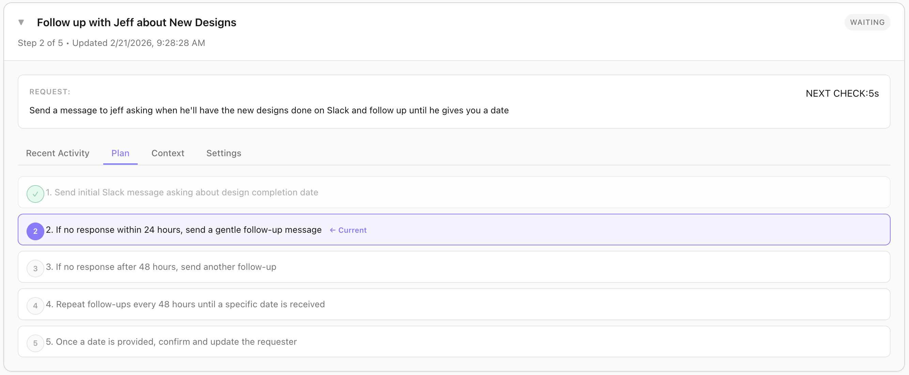

# Automated Tasks

<p align="center">
  
</p>

## Overview

Automated Tasks enable Wovly to perform scheduled or event-driven workflows in the background. From simple reminders to complex multi-step procedures, tasks run autonomously without your intervention. Schedule tasks to run at specific times, intervals, or in response to events like login, new messages, or calendar changes.

## How Tasks Work

### Task Execution Flow

```
Trigger Event → Task Scheduler → Task Executor → Actions → Result
     ↓               ↓                ↓             ↓         ↓
  "12pm"        Check tasks      Run task      Send email   Done
              (lunch reminder)   instructions   to self
```

**Components:**

**1. Task Scheduler**
- Monitors time-based triggers (hourly, daily, at specific times)
- Listens for event triggers (login, new email, calendar update)
- Maintains task queue and execution state

**2. Task Executor**
- Runs task instructions using available tools
- Handles multi-step procedures
- Manages errors and retries
- Logs execution results

**3. Task Storage**
- Active tasks: `~/.wovly-assistant/users/{username}/tasks/active/`
- Completed tasks: `~/.wovly-assistant/users/{username}/tasks/completed/`
- Scheduled tasks: `~/.wovly-assistant/users/{username}/tasks/scheduled/`

## Task Types

### 1. One-Time Tasks

Run once at a specific time.

**Example:** "Remind me to call John tomorrow at 3pm"

```json
{
  "id": "call-john-reminder",
  "name": "Call John Reminder",
  "type": "one-time",
  "schedule": {
    "datetime": "2026-02-22T15:00:00Z"
  },
  "instructions": "Send iMessage to user: 'Time to call John!'",
  "status": "pending"
}
```

**Usage:**
```
You: Remind me to call John tomorrow at 3pm

Wovly: ✓ Reminder set for tomorrow at 3:00pm
       Task ID: call-john-reminder
       I'll send you an iMessage at that time.
```

### 2. Recurring Tasks (Intervals)

Run repeatedly at fixed intervals.

**Example:** "Check for new emails every 30 minutes"

```json
{
  "id": "email-check",
  "name": "Email Check",
  "type": "recurring",
  "schedule": {
    "type": "interval",
    "intervalMinutes": 30
  },
  "instructions": "Check Gmail for new messages. If any are marked important, send me an iMessage with the subject lines.",
  "status": "active"
}
```

**Common intervals:**
- `intervalMinutes: 15` - Every 15 minutes
- `intervalMinutes: 60` - Every hour
- `intervalMinutes: 1440` - Every day

### 3. Scheduled Tasks (Specific Times)

Run at specific times of day.

**Example:** "Send me a morning briefing at 8am every weekday"

```json
{
  "id": "morning-briefing",
  "name": "Morning Briefing",
  "type": "scheduled",
  "schedule": {
    "type": "daily",
    "time": "08:00",
    "timezone": "America/New_York",
    "days": ["Monday", "Tuesday", "Wednesday", "Thursday", "Friday"]
  },
  "instructions": `
    Compile morning briefing:
    1. Get today's calendar events
    2. Check unread emails (top 5 important ones)
    3. List pending tasks due today
    4. Check insights (priority 4+)
    5. Send via iMessage with greeting
  `,
  "status": "active"
}
```

**Schedule types:**
- `daily` - Every day at specific time
- `weekly` - Specific days of week
- `monthly` - Specific day of month

### 4. Event-Driven Tasks

Run when specific events occur.

**Example:** "When I get an email from my boss, notify me immediately"

```json
{
  "id": "boss-email-alert",
  "name": "Boss Email Alert",
  "type": "event-driven",
  "event": {
    "type": "new_email",
    "filter": {
      "from": "boss@company.com"
    }
  },
  "instructions": "Send iMessage: 'New email from boss: {{email_subject}}'",
  "status": "active"
}
```

**Available events:**
- `new_email` - New email received
- `new_slack_message` - New Slack message
- `new_imessage` - New text message
- `calendar_event_soon` - Event starting in X minutes
- `calendar_event_added` - New calendar event created
- `login` - User logs into Wovly
- `insight_generated` - New insight with priority threshold

### 5. Multi-Step Tasks

Chain multiple actions in sequence.

**Example:** "Every Friday at 5pm, send weekly summary to team"

```json
{
  "id": "weekly-summary",
  "name": "Weekly Team Summary",
  "type": "scheduled",
  "schedule": {
    "type": "weekly",
    "day": "Friday",
    "time": "17:00"
  },
  "steps": [
    {
      "step": 1,
      "name": "Gather data",
      "instructions": "Search Slack for messages in #engineering from the past 7 days. Get top 10 discussions."
    },
    {
      "step": 2,
      "name": "Summarize",
      "instructions": "Use LLM to summarize the Slack discussions into bullet points. Group by topic."
    },
    {
      "step": 3,
      "name": "Format email",
      "instructions": "Create email with subject 'Weekly Engineering Summary - [date]' and body with the summary."
    },
    {
      "step": 4,
      "name": "Send to team",
      "instructions": "Send email to engineering@company.com"
    }
  ],
  "status": "active"
}
```

**Execution:**
- Steps run sequentially
- If a step fails, task pauses (unless configured to skip)
- Each step can use outputs from previous steps

<p align="center">
  
</p>

*Example of a multi-step task plan showing the breakdown of steps, their status, and execution flow.*

## Creating Tasks

### Method 1: Natural Language (Easiest)

Just describe what you want in plain English:

**Example 1:**
```
You: Remind me to eat lunch at 12pm tomorrow

Wovly: ✓ Task created: "Lunch reminder"
       Tomorrow at 12:00pm
       I'll send you a message at that time.
```

**Example 2:**
```
You: Every Monday at 9am, send me a list of this week's tasks

Wovly: ✓ Recurring task created: "Weekly task list"
       Schedule: Mondays at 9:00am
       First run: Next Monday (Feb 24, 2026)
```

**Example 3:**
```
You: Monitor emails from client@example.com every 15 minutes

Wovly: ✓ Task created: "Client email monitor"
       Interval: Every 15 minutes
       Filter: Emails from client@example.com
       Starting now.
```

### Method 2: Tasks Page (Advanced)

For more control, use the Tasks management page:

1. Go to **Tasks** tab in sidebar
2. Click **+ Create Task** button
3. Fill in details:
   - **Name:** "Lunch Reminder"
   - **Type:** One-time / Recurring / Scheduled / Event-driven
   - **Trigger:** Set schedule or event
   - **Instructions:** What to do when triggered
4. Click **Create Task**

### Method 3: JSON File (Power Users)

Manually create task files in `~/.wovly-assistant/users/{username}/tasks/`

**File:** `lunch-reminder.json`
```json
{
  "id": "lunch-reminder",
  "name": "Lunch Reminder",
  "type": "scheduled",
  "schedule": {
    "type": "daily",
    "time": "12:00",
    "days": ["Monday", "Tuesday", "Wednesday", "Thursday", "Friday"]
  },
  "instructions": "Send iMessage: '🍽️ Time for lunch!'",
  "enabled": true,
  "retryOnFailure": true,
  "maxRetries": 3,
  "skipOnHolidays": true,
  "createdAt": "2026-02-21T10:00:00Z",
  "lastRun": null,
  "nextRun": "2026-02-24T12:00:00Z"
}
```

## Task Instructions

Instructions can be simple or complex, using all available tools.

### Simple Instructions

**Fixed message:**
```json
{
  "instructions": "Send iMessage: 'Reminder to call John!'"
}
```

### Tool-Based Instructions

**Query and respond:**
```json
{
  "instructions": "Check Gmail for unread messages from the past hour. If there are any from VIPs, send me an iMessage with the subject lines."
}
```

**Available tools in task instructions:**
- `search_emails` - Search Gmail
- `get_calendar_events` - Fetch calendar
- `send_slack_message` - Send Slack message
- `send_imessage` - Send text message
- `search_custom_web_messages` - Query custom websites
- `create_task` - Create another task
- `analyze_with_llm` - Use AI for analysis

### Multi-Step Procedures

**Complex workflows:**
```json
{
  "steps": [
    {
      "name": "Collect data",
      "instructions": "Get calendar events for next week"
    },
    {
      "name": "Check conflicts",
      "instructions": "Analyze the calendar events for scheduling conflicts or overlaps"
    },
    {
      "name": "Report",
      "instructions": "If conflicts found, send email to self with details. Otherwise, confirm schedule is clear."
    }
  ]
}
```

### Conditional Logic

**Different actions based on conditions:**
```json
{
  "instructions": `
    Check unread email count.

    IF count > 10:
      Send iMessage: "You have {{count}} unread emails! Time to catch up."
    ELSE IF count > 0:
      Send iMessage: "{{count}} unread emails."
    ELSE:
      Do nothing (inbox zero!)
  `
}
```

### Template Variables

Use dynamic variables in instructions:

**Available variables:**
- `{{user_name}}` - User's name
- `{{current_date}}` - Today's date
- `{{current_time}}` - Current time
- `{{task_name}}` - This task's name
- `{{last_run}}` - Last execution time
- Tool output variables (e.g., `{{email_count}}`, `{{calendar_events}}`)

**Example:**
```json
{
  "instructions": "Send email to self: 'Task {{task_name}} completed at {{current_time}} on {{current_date}}.'"
}
```

## Task Scheduling

### Time-Based Schedules

**Daily at specific time:**
```json
{
  "schedule": {
    "type": "daily",
    "time": "08:00",
    "timezone": "America/New_York"
  }
}
```

**Weekdays only:**
```json
{
  "schedule": {
    "type": "daily",
    "time": "09:00",
    "days": ["Monday", "Tuesday", "Wednesday", "Thursday", "Friday"]
  }
}
```

**Weekly:**
```json
{
  "schedule": {
    "type": "weekly",
    "day": "Friday",
    "time": "17:00"
  }
}
```

**Monthly:**
```json
{
  "schedule": {
    "type": "monthly",
    "dayOfMonth": 1,
    "time": "09:00"
  }
}
```

**Interval:**
```json
{
  "schedule": {
    "type": "interval",
    "intervalMinutes": 30
  }
}
```

### Event-Based Triggers

**New email:**
```json
{
  "event": {
    "type": "new_email",
    "filter": {
      "from": "important@example.com",
      "subject_contains": "urgent"
    }
  }
}
```

**Calendar event starting soon:**
```json
{
  "event": {
    "type": "calendar_event_soon",
    "minutesBefore": 15
  }
}
```

**User login:**
```json
{
  "event": {
    "type": "login"
  }
}
```

**High-priority insight:**
```json
{
  "event": {
    "type": "insight_generated",
    "filter": {
      "priority": 4
    }
  }
}
```

## Task Management

### View Active Tasks

**Desktop UI:**
1. Go to **Tasks** tab
2. See list of all tasks with status:
   - 🟢 Active (enabled and running)
   - 🟡 Paused (temporarily disabled)
   - 🔴 Failed (last execution errored)
   - ⚪ Pending (waiting for next trigger)

**CLI:**
```
Task: Morning Briefing
Status: ✓ Active
Schedule: Daily at 8:00am (weekdays)
Last run: Today at 8:00am (success)
Next run: Tomorrow at 8:00am
```

### Enable/Disable Tasks

**Via UI:**
1. Click task card
2. Toggle "Enabled" switch
3. Disabled tasks won't execute

**Via File:**
Set `"enabled": false` in task JSON.

### Pause/Resume Tasks

Temporary pause without disabling:
```
You: Pause the morning briefing task for this week

Wovly: ✓ Task paused: "Morning Briefing"
       Will resume: Monday, Mar 3, 2026
```

**JSON:**
```json
{
  "paused": true,
  "pausedUntil": "2026-03-03T00:00:00Z"
}
```

### Edit Tasks

**Via UI:**
1. Click task card
2. Click "Edit" button
3. Modify schedule, instructions, or settings
4. Click "Save"

**Via File:**
Edit JSON file directly (changes detected automatically).

### Delete Tasks

**Via UI:**
1. Click task card
2. Click "Delete" button
3. Confirm deletion

**Via CLI:**
```
You: Delete the lunch reminder task

Wovly: ✓ Task deleted: "Lunch Reminder"
```

### View Task History

**Execution log:**
`~/.wovly-assistant/users/{username}/logs/tasks.log`

```
[2026-02-21 08:00:15] Task started: morning-briefing
[2026-02-21 08:00:15] Step 1: Fetching calendar events...
[2026-02-21 08:00:16] Step 2: Checking emails...
[2026-02-21 08:00:18] Step 3: Compiling briefing...
[2026-02-21 08:00:19] Step 4: Sending iMessage...
[2026-02-21 08:00:20] Task completed: morning-briefing (5.2s)
```

**Completed tasks:**
Moved to `~/.wovly-assistant/users/{username}/tasks/completed/` after execution (one-time tasks) or logged with timestamp (recurring tasks).

## Error Handling & Retry Logic

### Automatic Retry

When a task fails, Wovly can automatically retry:

```json
{
  "retryOnFailure": true,
  "maxRetries": 3,
  "retryDelayMinutes": 5
}
```

**Retry sequence:**
1. Task fails (e.g., Gmail API timeout)
2. Wait 5 minutes
3. Retry (attempt 2 of 3)
4. If fails again, wait 5 minutes
5. Retry (attempt 3 of 3)
6. If still fails, mark as failed and notify user

### Failure Notifications

**Configure notifications:**
```json
{
  "onFailure": {
    "notify": true,
    "method": "imessage",
    "message": "Task '{{task_name}}' failed after {{retry_count}} attempts: {{error_message}}"
  }
}
```

### Skip on Holidays

Prevent tasks from running on holidays:

```json
{
  "skipOnHolidays": true,
  "holidayCalendar": "US"
}
```

Supported calendars: US, UK, CA, custom

**Custom holidays:**
```json
{
  "skipOnDates": ["2026-12-25", "2026-01-01", "2026-07-04"]
}
```

### Graceful Degradation

If a tool is unavailable, tasks can fall back:

```json
{
  "instructions": "Try to send via Slack. If Slack is down, fall back to iMessage. If both fail, send email."
}
```

## Practical Examples

### Example 1: Daily Morning Briefing

**Scenario:** Every weekday at 8am, get a comprehensive morning update.

```json
{
  "id": "morning-briefing",
  "name": "Morning Briefing",
  "type": "scheduled",
  "schedule": {
    "type": "daily",
    "time": "08:00",
    "days": ["Monday", "Tuesday", "Wednesday", "Thursday", "Friday"]
  },
  "instructions": `
    Create morning briefing:

    1. CALENDAR
       - Get today's events
       - Check for conflicts
       - Highlight prep needed

    2. EMAIL
       - Unread count
       - Top 5 important emails with snippets
       - Urgent items flagged

    3. TASKS
       - Due today (priority sorted)
       - Overdue items (highlight)
       - Upcoming deadlines this week

    4. INSIGHTS
       - Priority 4+ insights from yesterday
       - Action items needing attention

    5. WEATHER (optional)
       - Current conditions
       - Any alerts

    Format with clear sections, emojis, and send via iMessage.
    Include motivational quote at end.
  `,
  "enabled": true,
  "skipOnHolidays": true
}
```

### Example 2: VIP Email Monitor

**Scenario:** Check every 15 minutes for emails from important people and notify immediately.

```json
{
  "id": "vip-email-monitor",
  "name": "VIP Email Monitor",
  "type": "recurring",
  "schedule": {
    "type": "interval",
    "intervalMinutes": 15
  },
  "instructions": `
    Search Gmail for unread emails from:
    - boss@company.com
    - ceo@company.com
    - client@bigclient.com

    If any found:
    1. Send iMessage with subject lines and senders
    2. Include snippet (first 100 chars)
    3. Mark as high priority
  `,
  "enabled": true,
  "retryOnFailure": true
}
```

### Example 3: End of Day Summary

**Scenario:** Every evening at 6pm, get a summary of the day and plan for tomorrow.

```json
{
  "id": "eod-summary",
  "name": "End of Day Summary",
  "type": "scheduled",
  "schedule": {
    "type": "daily",
    "time": "18:00"
  },
  "steps": [
    {
      "name": "Analyze today",
      "instructions": "Review today's calendar events, emails, and Slack messages. Summarize key accomplishments and discussions."
    },
    {
      "name": "Check tasks",
      "instructions": "List tasks completed today. Identify tasks still pending or overdue."
    },
    {
      "name": "Preview tomorrow",
      "instructions": "Get tomorrow's calendar. Highlight important meetings and prep needed."
    },
    {
      "name": "Send summary",
      "instructions": "Compile all into structured summary and send via email to self with subject 'EOD Summary - {{current_date}}'"
    }
  ],
  "enabled": true
}
```

### Example 4: Meeting Prep Reminder

**Scenario:** 15 minutes before every calendar event, send prep reminder if needed.

```json
{
  "id": "meeting-prep",
  "name": "Meeting Prep Reminder",
  "type": "event-driven",
  "event": {
    "type": "calendar_event_soon",
    "minutesBefore": 15
  },
  "instructions": `
    For the upcoming meeting:

    1. Check if there's an agenda (search email for meeting title)
    2. Search Slack/Email for recent messages with attendees
    3. Pull any relevant files or notes

    If prep materials found:
      Send iMessage: "Meeting in 15 min: {{meeting_title}}
                     Key context: {{summary}}"

    If no prep materials:
      Send iMessage: "Meeting in 15 min: {{meeting_title}} with {{attendees}}"
  `,
  "enabled": true
}
```

### Example 5: Weekly Team Update

**Scenario:** Every Friday at 5pm, compile and send team update email.

```json
{
  "id": "weekly-team-update",
  "name": "Weekly Team Update",
  "type": "scheduled",
  "schedule": {
    "type": "weekly",
    "day": "Friday",
    "time": "17:00"
  },
  "steps": [
    {
      "name": "Gather Slack discussions",
      "instructions": "Search #engineering channel for past 7 days. Get top 10 discussions by message count."
    },
    {
      "name": "Get GitHub activity",
      "instructions": "List merged PRs from past week in main repo."
    },
    {
      "name": "Check milestones",
      "instructions": "Query project tracker for completed milestones this week."
    },
    {
      "name": "Summarize with LLM",
      "instructions": "Use Claude to create concise summary of week's activities. Organize by: Highlights, Completed Work, Discussions, Next Week."
    },
    {
      "name": "Send email",
      "instructions": "Send email to team@company.com with subject 'Weekly Update - Week of {{current_date}}'"
    }
  ],
  "enabled": true,
  "skipOnHolidays": true
}
```

### Example 6: Daycare Message Digest

**Scenario:** Every evening at 7pm, summarize daycare messages from custom website.

```json
{
  "id": "daycare-digest",
  "name": "Daycare Daily Digest",
  "type": "scheduled",
  "schedule": {
    "type": "daily",
    "time": "19:00"
  },
  "instructions": `
    Search custom web messages from "brightwheel" for today.

    Summarize:
    - Activities (playtime, learning, outdoor)
    - Meals (breakfast, lunch, snacks)
    - Naps (time and duration)
    - Teacher notes
    - Any photos or special updates
    - Action items (forms, payments, etc.)

    Send via iMessage formatted nicely with emojis.
    If no messages today, send: "No daycare updates today."
  `,
  "enabled": true,
  "skipOnHolidays": false
}
```

## Best Practices

### 1. Start with Simple Tasks

Begin with basic reminders and single-action tasks:
- ✅ "Remind me to X at Y time"
- ✅ "Check emails every hour"
- ✅ "Send daily summary at 6pm"

Avoid complex multi-step workflows initially.

### 2. Use Descriptive Names

**Good:**
- "Morning Briefing - Weekdays 8am"
- "VIP Email Monitor - Every 15min"
- "Weekly Team Update - Fridays 5pm"

**Bad:**
- "Task 1"
- "Reminder"
- "Check thing"

### 3. Set Realistic Intervals

**Don't:**
- ❌ Check emails every 1 minute (excessive API calls, high cost)
- ❌ Run complex analysis every 5 minutes (slow, expensive)

**Do:**
- ✅ Check emails every 15-30 minutes (reasonable balance)
- ✅ Run analysis hourly or daily (manageable load)

### 4. Enable Retry Logic

Always enable retry for important tasks:
```json
{
  "retryOnFailure": true,
  "maxRetries": 3,
  "retryDelayMinutes": 5
}
```

### 5. Monitor Task Performance

Weekly review:
- Check task logs for failures
- Identify tasks that never succeed (fix or delete)
- Look for slow tasks (optimize instructions)
- Disable unused tasks

### 6. Use Appropriate Notification Methods

**For urgent tasks:**
- iMessage (instant, phone notification)
- Slack (if at desk)

**For summaries:**
- Email (can review later)
- WhatsApp (if mobile)

### 7. Respect Rate Limits

Be mindful of API limits:
- Gmail: 1 billion quota units/day (generous)
- Slack: 20 requests/min (tier 2+)
- LLM providers: Varies by plan

**Tip:** Batch requests when possible to reduce API calls.

### 8. Test Before Enabling

Before activating a task:
1. Create with `"enabled": false`
2. Manually trigger once: "Test task 'morning-briefing'"
3. Verify output is correct
4. Enable for scheduled execution

## Troubleshooting

### Task Not Running

**Check:**
1. Task is enabled (`"enabled": true`)
2. Schedule is correct (timezone, time format)
3. Next run time is in the future
4. No errors in last execution

**Debug:**
View task details:
```
You: Show details for task "morning-briefing"

Wovly: Task: Morning Briefing
       Status: Enabled ✓
       Schedule: Daily at 8:00am EST (weekdays)
       Last run: Today at 8:00am (success)
       Next run: Tomorrow at 8:00am
       Execution time: 4.2s
```

### Task Failing Repeatedly

**Check logs:**
`~/.wovly-assistant/users/{username}/logs/tasks.log`

**Common issues:**
- API credentials expired (Gmail, Slack)
- Integration disconnected
- Tool syntax error in instructions
- Network timeout

**Solutions:**
1. Re-authenticate integrations
2. Fix instruction syntax
3. Enable retry with longer delay
4. Simplify instructions if too complex

### Task Running at Wrong Time

**Possible causes:**
- Timezone mismatch
- Daylight saving time change
- System clock incorrect

**Solutions:**
1. Verify timezone in schedule:
   ```json
   {"time": "08:00", "timezone": "America/New_York"}
   ```
2. Check system time: `You: what time is it?`
3. Update task with explicit timezone

### Task Executing Too Often

**Possible causes:**
- Interval too short
- Event trigger too broad
- Multiple tasks with same trigger

**Solutions:**
1. Increase interval: `"intervalMinutes": 60` instead of `15`
2. Add event filters to narrow trigger
3. Disable duplicate tasks

### High LLM Costs

**Possible causes:**
- Tasks running too frequently
- Instructions too verbose
- Using Sonnet/Opus for simple tasks

**Solutions:**
1. Reduce task frequency
2. Use Haiku for simple tasks (see [Token Optimization Guide](../../TOKEN_OPTIMIZATION_GUIDE.md))
3. Enable prompt caching
4. Simplify instructions (shorter prompts)

## Advanced Features

### Conditional Task Execution

**Skip based on conditions:**
```json
{
  "executionConditions": [
    {
      "type": "integration_connected",
      "value": "gmail"
    },
    {
      "type": "user_profile_field",
      "field": "work_mode",
      "value": true
    }
  ]
}
```

Task only runs if Gmail connected AND user's work mode is enabled.

### Task Dependencies

**Chain tasks together:**
```json
{
  "dependencies": {
    "runAfter": ["email-check", "calendar-check"],
    "runBefore": ["send-summary"]
  }
}
```

Task waits for `email-check` and `calendar-check` to complete before running, and must finish before `send-summary` runs.

### Dynamic Scheduling

**Adjust schedule based on context:**
```json
{
  "dynamicSchedule": {
    "baseInterval": 30,
    "adjustments": [
      {
        "condition": "high_email_volume",
        "intervalMinutes": 15
      },
      {
        "condition": "after_hours",
        "intervalMinutes": 60
      }
    ]
  }
}
```

Check emails every 30 min normally, but every 15 min if volume is high, every 60 min after hours.

### Task Templates

**Reusable task patterns:**
```json
{
  "template": "reminder-template",
  "parameters": {
    "time": "{{TIME}}",
    "message": "{{MESSAGE}}"
  },
  "schedule": {
    "type": "one-time",
    "datetime": "{{TIME}}"
  },
  "instructions": "Send iMessage: {{MESSAGE}}"
}
```

**Instantiate:**
```
You: Remind me to call Sarah at 3pm

Wovly: [Creates task from template with TIME=3pm, MESSAGE="Call Sarah"]
```

## Related Documentation

- [Skills](./SKILLS.md) - Create custom response patterns
- [Insights](./INSIGHTS.md) - Tasks can analyze insights
- [Integrations](./INTEGRATIONS.md) - Tools available in task instructions
- [Interfaces](./INTERFACES.md) - Manage tasks from any interface

## Support

For task questions:
- [GitHub Issues](https://github.com/wovly/wovly/issues)
- [FAQ](../reference/faq.mdx)
- [Task Examples Repository](https://github.com/wovly/wovly-tasks)
